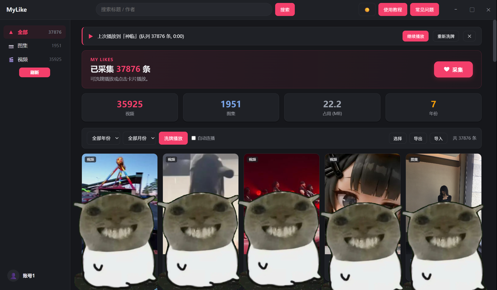

# MyLike

把抖音「喜欢」视频列表**完整保存到本地**，随时筛选、搜索、洗牌播放——不依赖抖音 App，几万条内容也能流畅浏览。

> 仅用于整理你自己的喜欢列表，仅供个人使用。本应用与抖音 / 字节跳动无任何关联。

---

## 界面截图



> 主界面

---

## 快速上手

1. **登录**：点**左下角账号区**（写着「未登录」的那一栏）→ 面板里点当前这条 → 在弹出的窗口完成抖音登录（支持扫码）→ 成功自动关窗
2. **采集**：点仪表盘右侧红色「❤ 采集」，抓取完整喜欢列表；顶部进度条实时显示进度，预检接口状态需几秒到几十秒，属正常
3. **播放**：点任意卡片从该条开始顺序播放；或点「洗牌播放」随机播放当前筛选结果

> **注意**：点赞上万的账号几乎必定触发接口限流，请等待一会儿后再采集，在弹窗里完成滑块验证后即可恢复正常。
>
> 采集完成后列表不会自动刷新，点左侧红色「刷新」按钮加载最新数据。

---

## 下载安装

1. 到 **[Releases](../../releases)** 页面下载最新版 **`MyLike.exe`**（推荐，直接下载，无需解压）
2. 放到任意目录（建议固定文件夹，如 `D:\MyLike`），双击运行——**无需安装 .NET、无需安装环境**

> 浏览器 / 下载工具拦截 exe 时，可改下 `MyLike-win-x64.zip`（内容就是同一个 exe）。

### Windows SmartScreen 提示怎么办

应用未购买代码签名证书，Windows 首次运行未签名程序会弹出「Windows 已保护你的电脑」，属正常现象：

1. 点击 **「更多信息」**
2. 点击 **「仍要运行」**
3. 之后正常使用（每台电脑只需操作一次）

> 应用不含恶意代码，源码完全开源可自行审查；要求 Windows 10/11，系统需有 WebView2 Runtime（一般随 Edge 自带，缺失时应用内会给出下载指引）。

---

## 功能特性

### 采集

- 一键抓取完整「喜欢」列表（标题 / 作者 / 发布时间 / 封面 / 类型）
- 增量采集：再次采集只补新内容，自动去重，翻到断点即停
- 断点续采：中途失败 / 限流 / 手动停止后，从上次进度继续，不遗漏不重复
- 超长列表自动分轮：单轮 200 页（约 3600 条）到上限后自动接着采，进度条显示「第 N 轮」
- 风控自愈：接口被限自动暂停并提示，完成滑块验证后自动断点续采

### 播放

- **先出画面再取链**：点播放立刻打开播放页，随后实时获取播放地址（1~2 秒），链接不落盘、每次都是新鲜的
- 洗牌播放：随机播放当前筛选范围；点卡片可从该条开始顺序播放
- **继续上次播放**：手动退出播放页或播放中直接关掉应用，下次打开主界面会提示「上次播放到…」，一键回到该条与那个位置（整轮播完不再提示）
- **实况（动图）图集**：带动态子链的图集会播放动态画面，播完停顿后再继续，节奏与抖音一致
- 图集支持：图文帖自动轮播、进度条预览跳选、背景音乐播放、长文案「展开」看全文
- 倍速播放：控制条「1x」循环切 0.75x ~ 2x，切歌后保持倍速
- 播放队列：播放页右侧「播放列表」侧栏（当前项红色呼吸高亮、自动居中跟随），点条目直接跳播，长列表滚动自动加载
- 快进快退：`←` / `→` 键 ±10 秒（图集为翻张）；时间码实时显示；滚轮切歌（播放列表内滚轮只滚列表）
- 原页看评论：一键跳转抖音原视频页，关闭后从记忆进度续播
- 快捷键可自定义：播放页「快捷键」面板改键 / 还原，`Esc` 返回固定不可改

### 外观与窗口

- **深色 / 浅色一键切换**（右上角 🌙 / ☀️）：应用级设置，**切换账号也保持不变**
- 自绘无边框窗口：顶部拖动移动、最小化 / 最大化 / 关闭；播放页顶部同样有拖动区与最小化按钮

### 数据管理

- 多维筛选：全部 / 视频 / 图集分类 + 年份 + 月份 + 标题作者搜索
- 手动刷新：采集 / 导入后点左侧「刷新」按钮手动加载最新列表
- 勾选批量删除；`.dylist` 导入 / 导出备份，换电脑零成本迁移（导入是合并式的，也常被用来汇总多个账号的内容）
- 仪表盘「占用 (MB)」显示当前账号数据目录体积，心里有数

### 批量取消点赞

- 选择模式下勾选多个作品，点「取消点赞」逐个在抖音侧取消；原「删除」仅删本地记录，行为不变
- 复用现有 WebView2 登录态，不保存或上传 Cookie
- 实时进度条，可随时停止；成功一条即时保存，中断后重跑只处理剩余
- 自动节流：正常时较快，遇异常自动放慢；触发风控自动暂停，完成滑块验证后即可续跑
- 一次超过 50 条会先做一次风险确认（可勾选「不再询问」）
- 与采集 / 播放互斥运行，互不干扰
- 抖音网页接口可能随平台更新变化，功能失效时需要适配

---

## 数据与隐私

- **全部数据在本机** `%LOCALAPPDATA%\DouyinShuffle\`，按账号分目录：

  ```
  accounts.json                 账号清单（含每个账号实际使用的目录绑定）
  settings.json                 应用级设置（主题）
  init.log                      运行日志
  Data\<账号>\items.dylist      播放列表（仅元数据）
  Data\<账号>\state.json        采集断点 / 账号标识
  Data\<账号>\resume.json       上次播放位置（用于「继续上次播放」）
  Profiles\<账号>\              WebView2 用户目录（该账号的登录态）
  ```

- **播放链接不落盘**：链接有时效，播放时实时获取，本地不保存任何播放地址
- **不上传任何服务器**：数据与登录信息全部留在本机
- **切换账号不改外观**：主题存在 `settings.json`，不属于任何账号
- **备份迁移**：重装 / 换机前用「导出」生成 `.dylist`，新环境「导入」恢复（登录态需重新登录）

---

## 技术架构

- **宿主**：WPF（.NET 10）+ WebView2，界面与播放器均为本地网页（嵌入程序集，随 exe 发布）
- **双 WebView + z-order 切换**：主界面与播放页是两个常驻可见的 WebView，切换视图 = 用 Win32 `SetWindowPos` 抬升 z-order。这从根本上避免了「隐藏期间 Chromium 视口冻结在陈旧尺寸 → 播放页缩在左上角」的老问题
- **核心机制「浏览器即签名器」**：所有抖音接口请求都在一个屏幕外的隐藏抖音页中执行，由页面自身签名层自动补齐参数——应用不做任何逆向，抖音改版容错率高
- **一账号一 profile**：WebView2 环境按账号的 profile 目录创建，换账号 = 拆旧环境、建新环境；账号实际使用的目录名写入 `accounts.json` 持久化，新增 / 删除账号都不会改变既有账号的数据与登录态位置
- **统一风控状态机**：接口失败 / 挂起 / 滑块验证 / 恢复由单一状态机管理（Normal → RiskHeld → Verifying），各场景统一上报与恢复，杜绝散落逻辑
- **统一响应分类器**：所有脚本用同一套分类判定「有效 JSON / 验证页 / 黑洞 / 假数据 / 接口报错」，杜绝漏判
- 采集 / 播放 / 存储 / 日志分层解耦，单文件发布（自包含，免装运行时）

---

## 项目结构

```
src/DouyinShuffle.Win/
├─ App.xaml.cs / AppLog.cs         应用入口（异常兜底）/ 统一日志
├─ MainWindow.xaml.cs              UI 宿主：WebView2 编排、账号换舱、命令泵、窗口控制
├─ CollectOrchestrator.cs          采集编排：探测 → 预检 → 翻页 → 风控 → 断点续采
├─ Capture/
│  ├─ RiskStateMachine.cs          风控统一状态机（挂起 / 验证 / 恢复）
│  ├─ AwemeItem.cs                 数据模型（链接字段 [JsonIgnore]）
│  ├─ AwemeParser.cs               响应解析（含实况动态子链提取）
│  ├─ LikeCollector.cs             采集执行 + 消息泵 + 增量去重 + 实时取链
│  ├─ DouyinProbe.cs               接口探针（self / favorite / detail 三态判定）
│  ├─ ScriptLoader.cs              嵌入 JS 加载器（自动注入共享分类器）
│  └─ Scripts/                     采集 / 探测 / 取链脚本 + 统一分类器 classify.js
├─ Player/                         播放层
│  ├─ PlaybackController.cs        队列 / 取链 / 预取 / 失效跳过 / 续播位置
│  └─ LinkProber.cs                直链有效性探测（首活即用）
├─ Storage/                        存储层
│  ├─ LikeListStore.cs             播放列表与同步状态（原子写）
│  ├─ AccountStore.cs              账号清单与目录绑定（accounts.json）
│  ├─ AppSettings.cs               应用级设置（settings.json：主题）
│  ├─ ResumeStore.cs               续播快照（resume.json）
│  └─ AtomicFile.cs                原子写入（tmp + Replace）
├─ Export/Exporter.cs              .dylist 导入 / 导出
└─ WebUi/                          本地前端（嵌入资源，运行时提取）
```

---

## 常见问题

应用内右上角「**常见问题**」有更完整的一份（采集 / 账号 / 播放 / 数据 / 界面五类）。这里放最常被问到的：

- **采集数量比抖音显示的喜欢数少？** 正常：已下架 / 删除 / 私密的内容接口不再返回，少几千到几万条都属正常现象。
- **采集太慢 / 采不动？** 多为平台限流。采集会自动暂停并提示，等一会儿再点「采集」，预检通过后会弹出滑块验证，完成后自动续采。
- **点采集后「正在检查接口状态…」要等多久？** 正常几秒；接口受限时可能需要几十秒，属正常流程。
- **视频有声音但没画面 / 整个播放页白屏？** ① 部分内容为 H.265 编码、系统缺 HEVC 解码 → 会自动尝试备用链接，仍不行请装 Windows「HEVC 视频扩展」；② 整个界面发白（连按钮都看不到）而用浏览器打开抖音正常 → 多为 WebView2 Runtime 太旧，安装最新 Evergreen 版后重启应用。
- **「删除」和「取消点赞」的区别？** 「删除」只把该条移出本地列表（抖音点赞仍在）；「取消点赞」才是真正去抖音取消点赞——只有确认成功才移除本地，批量逐条节流、可随时停止，触发风控会自动暂停并弹验证。
- **实况（动图）为什么有的不动？** 取决于抖音接口有没有返回这条内容的动态子链：返回了就按实况播放，没返回只能显示静态图，不是显示问题。
- **多账号怎么共用一份列表？** 用「导出 / 导入」：A 账号导出 → 切到 B 账号导入（导入是合并式的，按内容去重）。
- **数据在哪？重装会丢吗？** 全在 `%LOCALAPPDATA%\DouyinShuffle\`（按账号分目录）。重装 / 换机前先「导出」，新环境「导入」恢复。
- **窗口边缘拖不动、不能自由缩放？** 应用是无边框窗口，边缘缩放区域被播放内核占满，属架构限制；调整大小请用右上角「最大化 / 还原」，或 `Win`+`↑` / `Win`+`↓`（最大化 / 还原）、`Win`+`←→`（贴半屏）。
- **支持收藏夹吗？** 当前版本仅支持「喜欢」列表。

---

## 免责声明

- 本项目仅供**个人学习与本地数据整理**使用，请勿用于任何商业用途或违反平台服务条款的场景
- 应用与抖音 / 字节跳动**无任何关联**，不为其产品背书
- 采集行为需遵守抖音的用户协议与相关法律法规；采集数据为**用户本人的账号内容**，请自行承担合规责任
- 项目作者不对因使用本应用产生的任何账号封禁、数据丢失等问题负责

## License

[MIT](LICENSE) — 仅供个人使用；请遵守所使用平台的服务条款。
